# Web Proxy

## Requirements

- Respond to HTTP HTTPS requests and should display each request on a management console. It should forward the request to the Web server and relay the response to the browser.
- Handle websocket connections.
- Dynamically block selected URLs via the management console.
- Efficiently cache requests locally and thus save bandwidth. You must gather timing and bandwidth data to prove the efficiency of your proxy.
- Handle multiple requests simultaneously by implementing a threaded server.

## Browser Setup

I used Mozilla Firefox to test the proxy server. I had to configure the following Network Settings to enable the proxy. The port here has to be the same as the one the proxy is listening to.

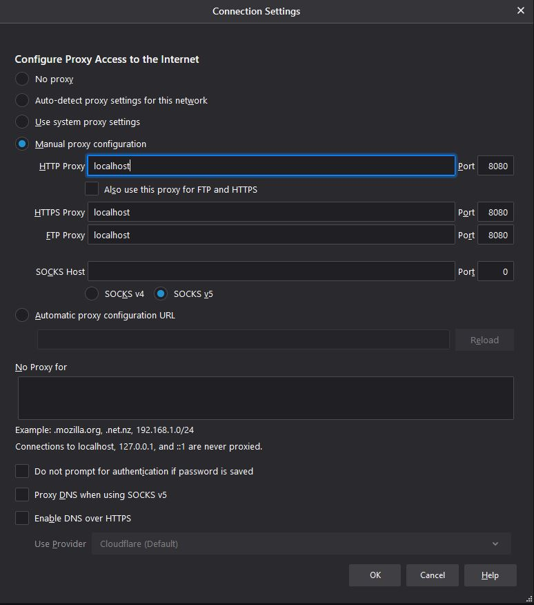

## Design

The proxy listens to a certain port for any requests from the client, if a request is received, a new thread is created and the connection is then handled on that thread. This allows for multiple connections to be handled at once. First the request line is parsed to gather the method and URL. Once these are known, it can be determined whether the request is HTTP or HTTPS, and it can be handled accordingly (if the URL is not blocked). A cache is implemented to improve efficiency.

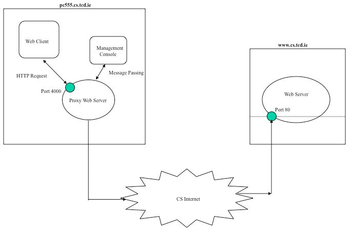

## User Interface

The GUI (developed with tkinter) allows for blocking and unblocking of the entered URL, as well as printing the state of the block-list and cache in the console.

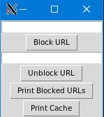

## Blocking

Blocking a URL adds this URL to a block-list which prevents it from being reached. This action is logged in the console.

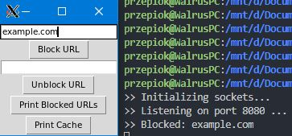

When attempting to access a blocked URL, the following message is printed in the console, and as expected the site isn’t loaded.

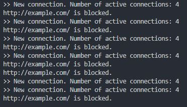

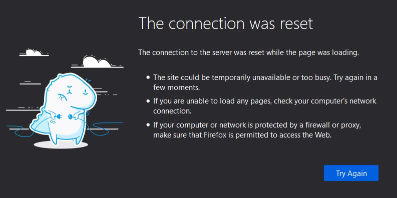

## Unblocking

Unblocking URLs removes them from the block-list. This action is also logged in the console.

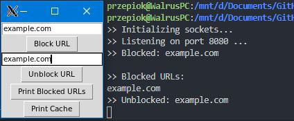

Accessing the URL is now possible again.

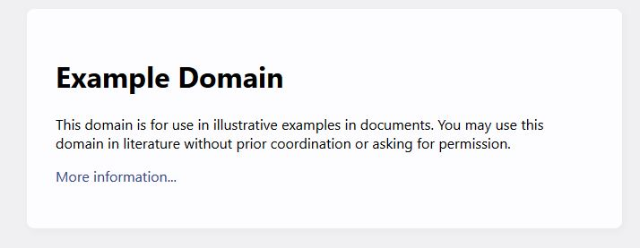

## HTTP vs HTTPS

When a request comes in, the request line is parsed for the method and URL. Once the method is identified, the request can be handled accordingly.

- HTTP uses the GET method
- HTTPS uses CONNECT method

For HTTP a connection is created, and if data (from server) is not empty, it is sent to the browser. The connection is stopped when a zero length chunk is received. HTTP responses are cached to improve efficiency of future requests.

For HTTPS a 3-way handshake first needs to be established as it is a secure protocol. Following this it is similar to HTTP where data is forwarded from the server to the client (if not empty). The cache is not used for HTTPS.

## Caching

### Cache Miss

Before a request is handled, the proxy checks whether the URL is stored in the cache. The first time a URL is visited, it will result in a cache miss. The time taken to complete the request is logged in console, and the server response (with URL as key) is cached for future use.

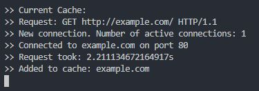

### Cache Hit

If a URL is already in the cache then the server response is simply taken from cache rather
than being requested from the server again. The time taken to complete the request is printed inside the console to showcase the efficiency of the cache.

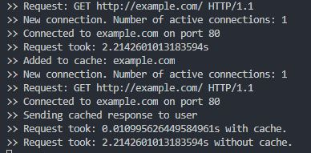

## Websockets

[Web Socket Echo Test](https://www.websocket.org/echo.html) was used for testing websockets.

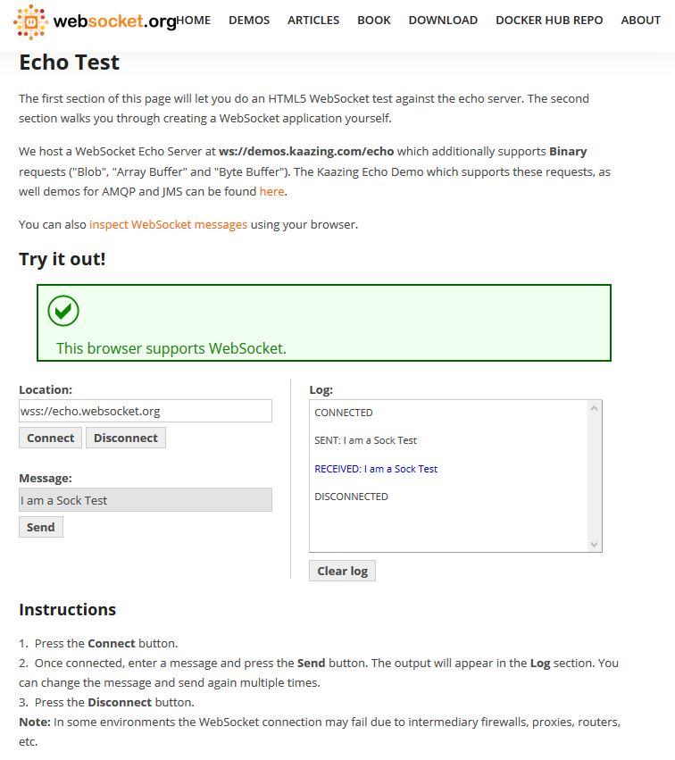